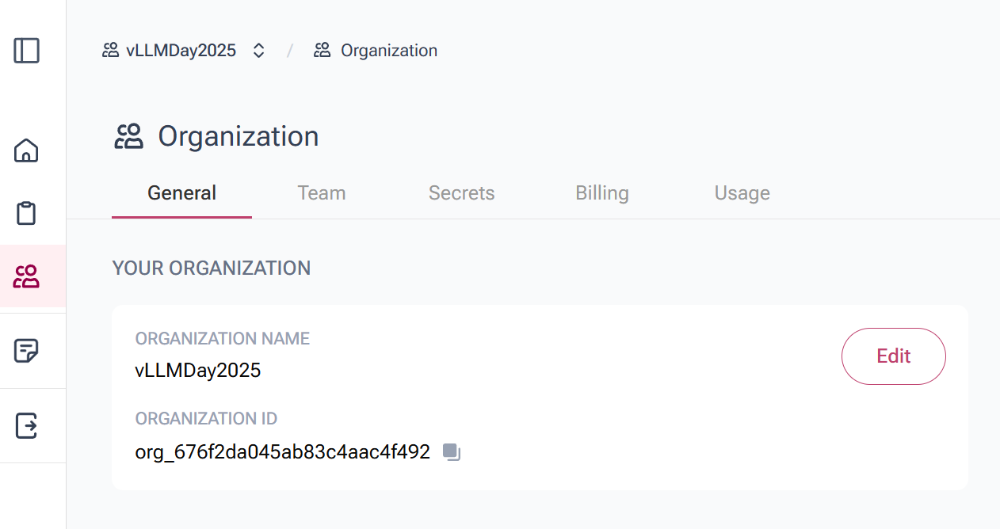
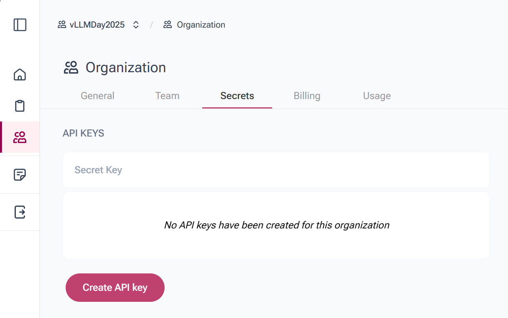
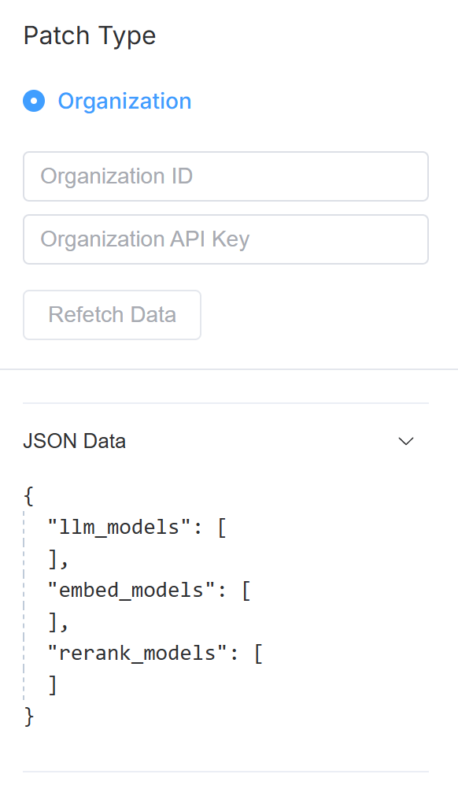
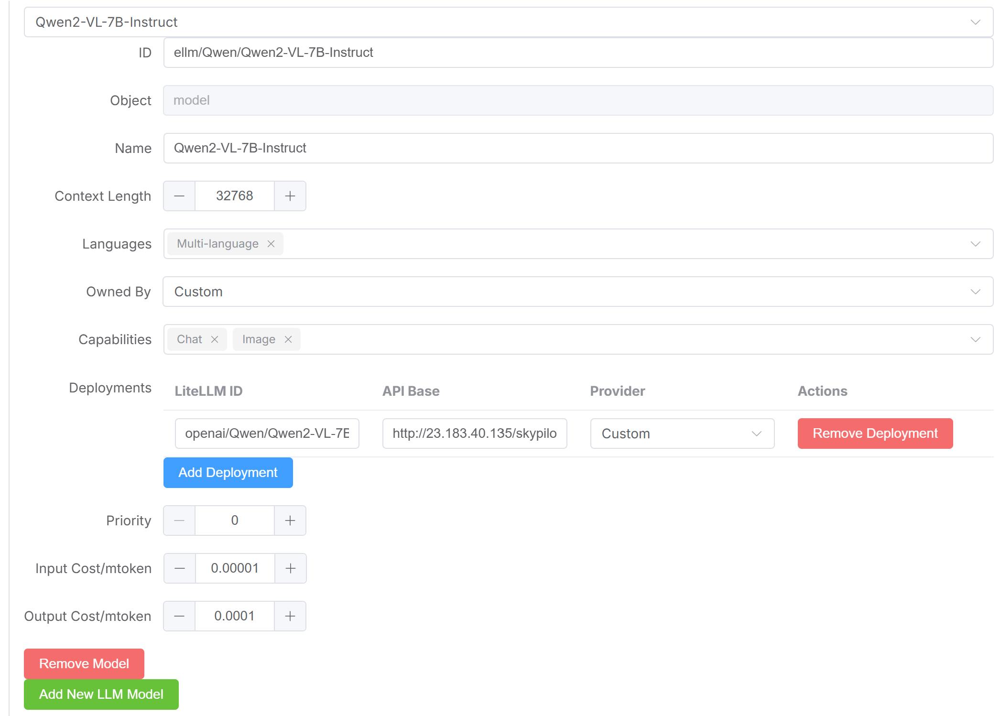
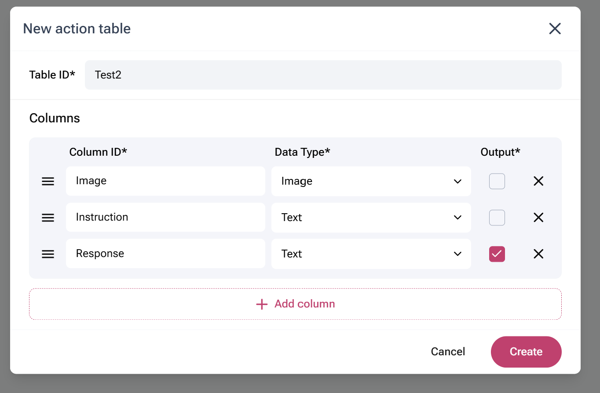
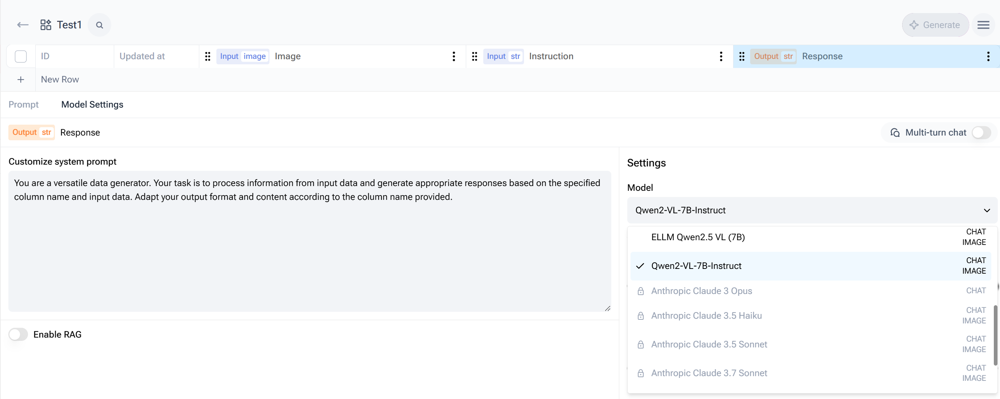

# Deploying vLLM model at lightning speed

1. `pip install git+https://github.com/Hoipang/tokenvisor-cli.git`
2. Create your Infrastructure as Code (IaC) configuration file:

Tutorial template:
```yaml
api:
    address: llmcluster.embeddedllm.com
    port: 8000

envs:
    VLLM_USE_TRITON_FLASH_ATTN: false
    VLLM_ROCM_USE_AITER: true

model:
    model_name: Qwen/Qwen2-VL-7B-Instruct
    args: --served-model-name Qwen/Qwen2-VL-7B-Instruct --max-model-len 32768

resources:
    cpus: 8
    memory: 32
    ports: 8000
    accelerators: MI300X:1
    image_id: docker:ghcr.io/embeddedllm/vllm-rocm:v0.8.2-18ed313

service:
    ports: 8000
    readiness_probe: /v1/models
```

The full template
```yaml
api:
    address: llmcluster.embeddedllm.com
    port: 8000

envs:
    VLLM_USE_TRITON_FLASH_ATTN: false
    VLLM_ROCM_USE_AITER: true
    VLLM_ROCM_USE_AITER_LINEAR: True
    VLLM_ROCM_USE_AITER_MOE: True
    VLLM_ROCM_USE_AITER_FP8_BLOCK_SCALED_MOE: False
    VLLM_ROCM_USE_AITER_RMSNORM: True
    VLLM_WORKER_MULTIPROC_METHOD: "spawn"   
    VLLM_IMAGE_FETCH_TIMEOUT: 5
    VLLM_VIDEO_FETCH_TIMEOUT: 30
    VLLM_AUDIO_FETCH_TIMEOUT: 10
    VLLM_RPC_TIMEOUT: 10000

model:
    model_name: Qwen/Qwen2-VL-7B-Instruct
    args: --served-model-name Qwen/Qwen2-VL-7B-Instruct --max-model-len 32768

resources:
    cpus: 8
    memory: 32
    ports: 8000
    accelerators: MI300X:1
    image_id: docker:ghcr.io/embeddedllm/vllm-rocm:v0.8.2-18ed313

service:
    ports: 8000
    readiness_probe: /v1/models
```

3. Deploy your vLLM:
`mipod-cli deploy -f vLLMAsiaDay.yaml`

Example output:
```
Configuration successfully sent to the API server.
{'status': 'success', 'message': 'Model deployed received successfully', 'service_name': 'Qwen-Qwen2-VL-7B-Instruct-20250402-154548-b521e95b', 'api_base': 'http://23.183.40.135/skypilot/default/sky-serve-controller-1db73563-1db73563/30002/v1'}
```

4. Check if your vLLM server has initialized or not and to know the model name:
`curl <api_base>/models`. 

Example: 
```
$ curl http://23.183.40.135/skypilot/default/sky-serve-controller-1db73563-1db73563/30002/v1/models
```

Example SUCCESSFUL Response:

```
{"object":"list","data":[{"id":"Qwen/Qwen2-VL-7B-Instruct","object":"model","created":1743609012,"owned_by":"vllm","root":"Qwen/Qwen2-VL-7B-Instruct","parent":null,"max_model_len":32768,"permission":[{"id":"modelperm-7b66c67486014826af76e9cfd46e96fd","object":"model_permission","created":1743609012,"allow_create_engine":false,"allow_sampling":true,"allow_logprobs":true,"allow_search_indices":false,"allow_view":true,"allow_fine_tuning":false,"organization":"*","group":null,"is_blocking":false}]}]}
```

Example Provisioning Response:

```
# If the vLLM server is not ready yet
{"detail":"No ready replicas. Use \"sky serve status [SERVICE_NAME]\" to check the replica status."}
```

5. Sign-up JamAI Base

6. Go to the organization Tab
    i. Get your Org ID
    
    ii. Create API Key
    

7. Go to https://llmendpoint.embeddedllm.com/

Login details:
* user
* vllmSGmeetup2025

8. Key in your Org ID and API Key 



9. Now, `Add new LLM Model`

10. Fill up the following fields:

* ID: ellm/Qwen/Qwen2-VL-7B-Instruct
* Name: Qwen2-VL-7B-Instruct
* Context Length: 32768
* Languages: Multi-language
* Owned By: Custom
* Capabilities: Chat, Image
* Click `Add Deployments`:
  * LiteLLM ID: openai/Qwen/Qwen2-VL-7B-Instruct
  * API Base: `http://23.183.40.135/skypilot/default/sky-serve-controller-1db73563-1db73563/30002/v1`
  * Provider: Custom
* Priority: 0
* Input Cost/mtoken: 0.00001
* Output Cost/mtoken: 0.00001



11. Create a New Action Table.



12. You can now find the model in the model list.

